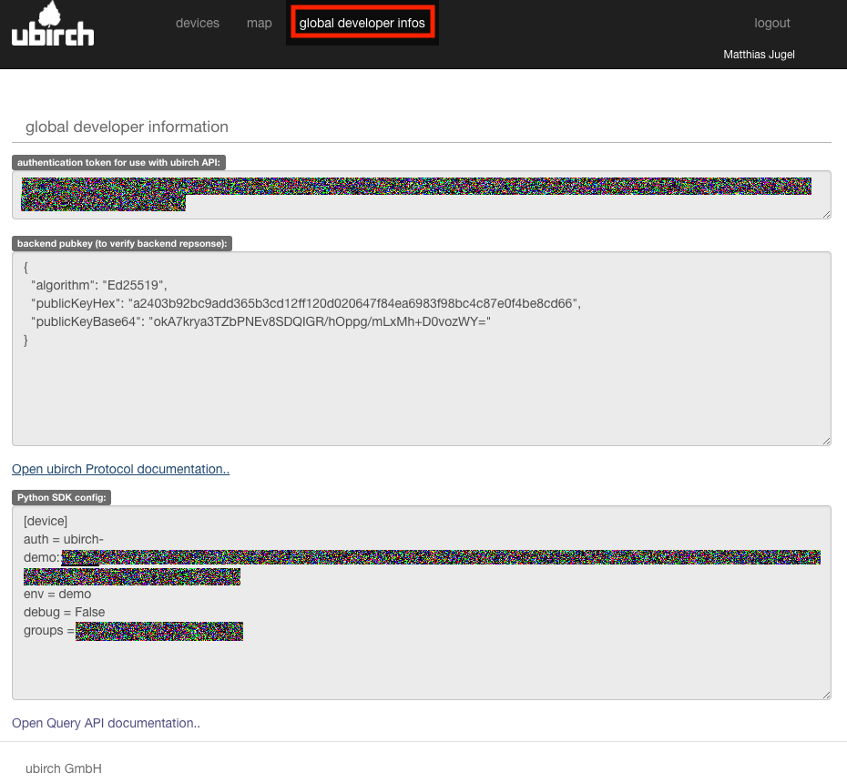
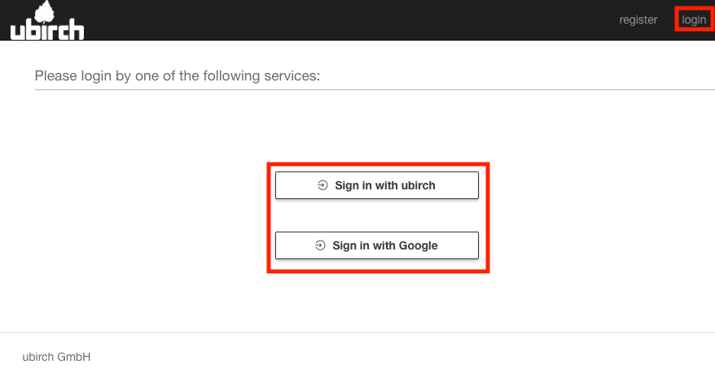

# Cloud Services

The ubirch cloud services are provided through a [backend portal](https://ubirch.dev.ubirch.com) and number of
[APIs](api) that allow the registration of keys, verification of data and seals and
accessing and forwarding of data of your data.

## Development Portal

[Registration & Visualization](https://ubirch.dev.ubirch.com)
The portal can be used to see registered devices, visualized data for supported payloads and
development information to stream and retrieve data from the cloud services.

### Device List

The developer portal lists devices the user has access to. It allows the setting configuration
parameters abd visualizes data received.

### Data Visualization  

The data visualization displays the received data and a graph of data points that are known.

### Developer Information

Use the developer information to set up the devices. The information is necessary to access the ubirch
cloud services, but also to verify responses from the ubirch cloud services on the devices. Please see
our [examples](examples) for details.

## Registration

To start development, please follow these steps to register with the ubirch cloud services:

### 1. Visit [ubirch.dev.ubirch.com](https://ubirch.dev.ubirch.com)
### 2. Klick **register** in the top right menu.

### 3. Select the **service to register** through:

### 4. Wait for the **activation** of your account.

### 5. Login:

After [logging in](https://ubirch.dev.ubirch.com) the developer cloud services are ready to be used. Check the developer info.  

---

## APIs

> Please [register](#registration) before using any of the APIs below.

- [Data/Verification API](api?url=https://raw.githubusercontent.com/ubirch/ubirchApiDocs/master/swaggerDocs//ubirch/avatar_service/1.0/ubirch_avatar_service_api.json) (v1.0)

  The data verification API accepts ubirch-protocol messages for key registration, signed data packets, chained data
  packets and verifies these before forwarding to any further processing. Additionally, it provides an interface
  to verify payload hashes and retrieve the corresponding seals.

- [Notary API](api?url=https://raw.githubusercontent.com/ubirch/ubirchApiDocs/master/swaggerDocs//ubirch/notary_service/1.0/ubirch_notary_service_api.yaml) (v1.0)

  Internally, the ubirch cloud services use the notary API for anchoring data in the blockchain. While we recommend to
  only anchor trusted data in a blockchain, this service is available standalone.

> While some of the endpoints accept JSON data, it is recommended to use the [msgpack](https://msgpack.org/index.html).
> variant. The byte oriented msgpack format prevents issues when creating the data hash and signatures of the data
> packets.
